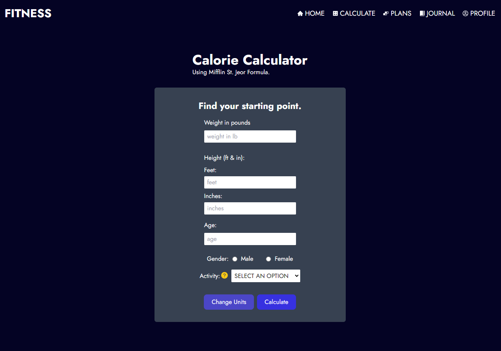
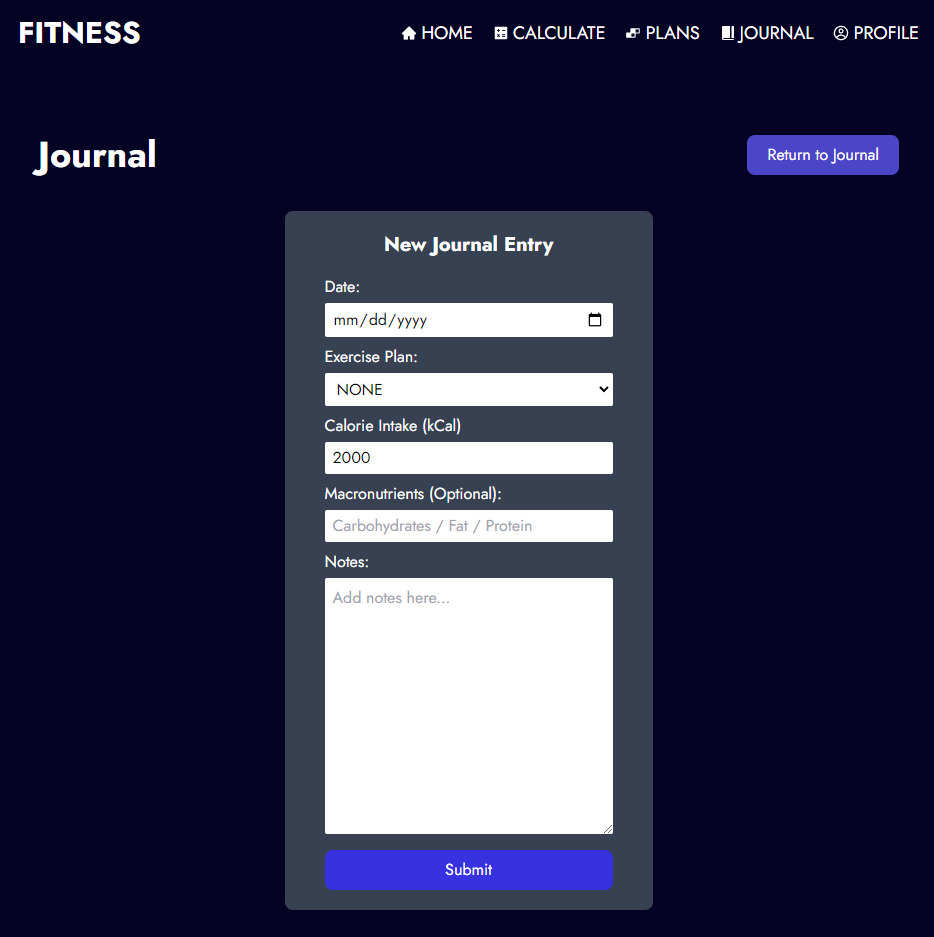
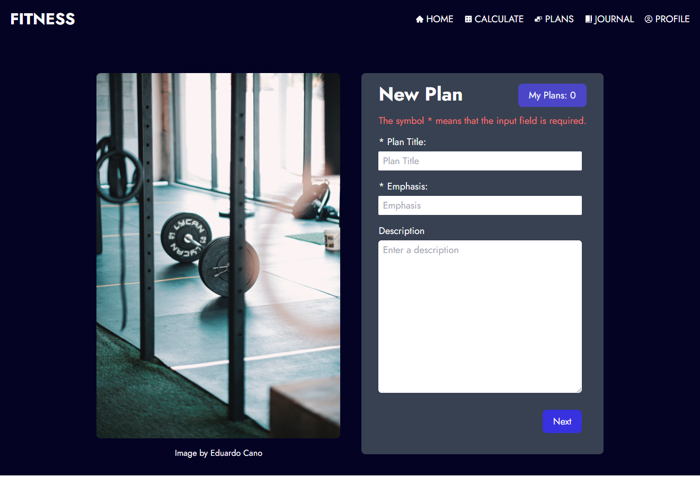

# fitness-app

This fitness app was developed to provide users access to fundamental fitness tools that will enable user to achieve their fitness goals

## Functionality:
    - User Authentication
    - Calorie Calculator
    - Exercise Planner (Create and View Exercise Plans)
    - Daily Journal (Create and View Journal Entries)
    - Send Feedback

## Technologies used:
    - Web Development Fundamentals (HTML, CSS, and JavaScript)
    - ReactJS
    - NodeJS/ExpressJS
    - MongoDB
    - TailwindCSS

## WIP/TODOS:
    - Add functionality to analytics in profile
    - FAQ Page
    - Select Plan functionality in caloriePlan component

## Preview:

